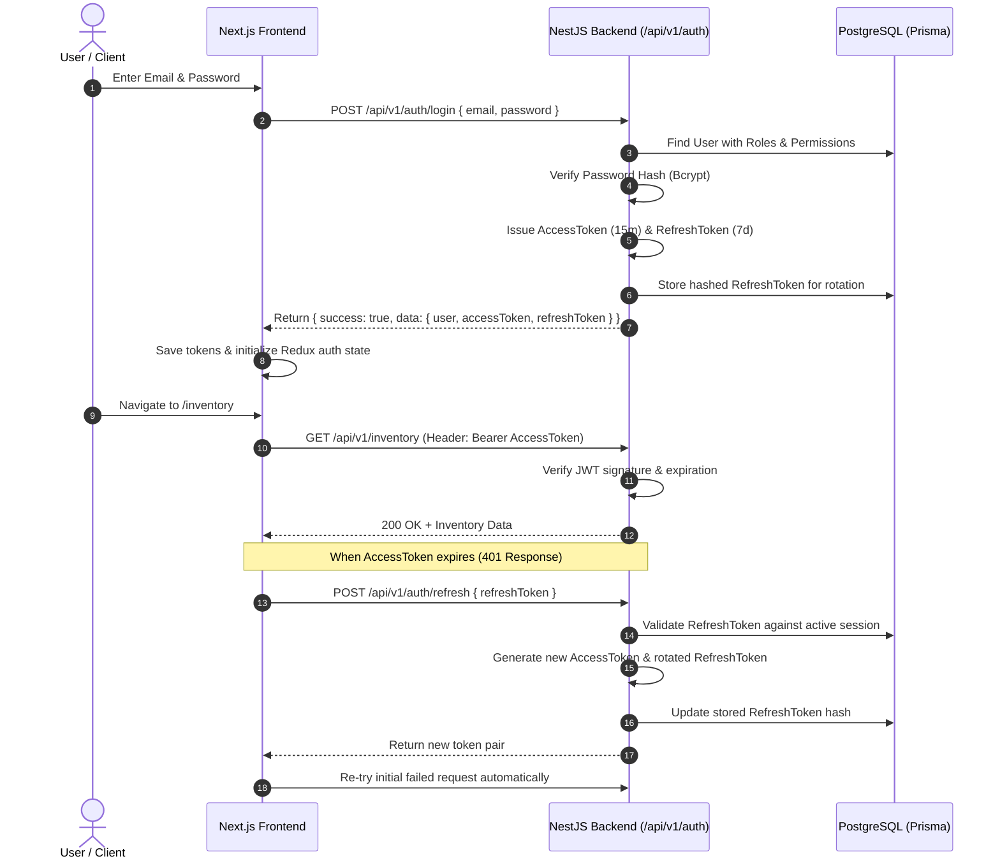

# YarnTrace Authentication & Authorization Architecture

## 1. Authentication Strategy

YarnTrace implements a secure, stateless dual-token architecture using **JSON Web Tokens (JWT)** and **Bcrypt / Argon2** password hashing.

> [!IMPORTANT]
> YarnTrace explicitly uses internal JWT authentication and does NOT use Firebase Authentication or any third-party auth provider.

---

## 2. Token Lifecycle & Specifications

| Token Type | Lifespan | Stored Location | Purpose | Signature / Payload |
|---|---|---|---|---|
| **Access Token** | 15 Minutes (`JWT_ACCESS_EXPIRES_IN`) | Authorization Header (`Bearer`) / In-Memory State | API resource authorization | User ID, Email, Role, Granted Permissions |
| **Refresh Token** | 7 Days (`JWT_REFRESH_EXPIRES_IN`) | HttpOnly Cookie / Secure Storage | Generating new access tokens | User ID, Token Family / Hash ID |

---

## 3. Authentication Flow Diagram

---

## 4. Security Principles & Hardening

1. **Password Hashing**: Passwords are never stored in plain text. Hashed using Bcrypt with standard salt rounds (10+) or Argon2id.
2. **Token Invalidation**: Logout requests invalidate the refresh token in the database, preventing token reuse.
3. **No Sensitive Data in State**: Password hashes and refresh token secrets are stripped from responses and never stored in client-side Redux.
4. **CORS & Rate Limiting**: Backend limits unauthorized endpoint abuse and restricts cross-origin calls to verified origins.
