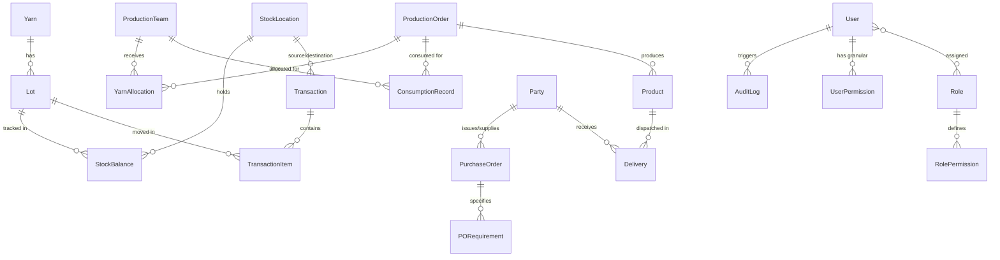

# YarnTrace Database Architecture & Schema Specification

## 1. Overview & Core Principles

The YarnTrace database is modeled on **PostgreSQL** using **Prisma ORM**.

### Core Invariants
1. **Quantity Precision**: All quantity, gross weight, net weight, tare, and balance fields are defined as `Decimal(12, 4)` to eliminate floating-point rounding errors in inventory tracking.
2. **Deterministic Identifiers**: Primary keys utilize UUID v4 (`@default(uuid())`) or CUID for distributed consistency.
3. **Audit Trail**: Every mutable entity includes `createdAt`, `updatedAt`, and optional `createdBy` / `updatedBy` user references.
4. **Relational Traceability**: The schema establishes a continuous chain linking yarn receipt -> lot creation -> stock movement -> team allocation -> consumption -> production order -> product -> party delivery.

---

## 2. Entity Domains & Relationship Graph

---

## 3. Database Entity Dictionary

### A. Identity & Access Control
- **`User`**: System actors (administrators, stock heads, production managers, operators).
- **`Role`**: Named RBAC groups (`ADMIN`, `STOCK_HEAD`, `PRODUCTION_HEAD`, `OPERATOR`, `AUDITOR`).
- **`Permission`**: Granular capability keys (e.g. `view_inventory`, `add_yarn`, `issue_yarn`, `record_consumption`).
- **`RolePermission`**: Junction table mapping roles to permissible actions.
- **`UserPermission`**: Direct user-specific permission overrides (grants or revocations).

### B. Yarn & Lot Master
- **`Yarn`**: Master yarn catalog (blend, count/Ne, color, composition, type: GREY, DYED, COMBED, CARDED).
- **`Lot`**: Specific supplier or manufacturing batch of yarn with lot number, supplier reference, received date, and initial net weight.

### C. Inventory & Stock Movement
- **`StockLocation`**: Physical or logical storage points (e.g. Main Warehouse, Floor Silo, Bay A, Loom Pre-stage).
- **`StockBalance`**: Current real-time aggregated quantity (`Decimal(12, 4)`) of a specific `Lot` at a specific `StockLocation`.
- **`Transaction`**: Header for stock movements (`RECEIVED`, `OPENING`, `ISSUED`, `RETURNED`, `RETIRED`, `ADJUSTMENT`).
- **`TransactionItem`**: Line items detailing lot, quantity in KG, bags/cones count, source and target locations.

### D. Production & Consumption
- **`ProductionTeam`**: Operational teams/departments (e.g. Warping Team, Ring Spinning Bay 2, Weaving Line C).
- **`ProductionOrder`**: Work order detailing target product, target quantity, and scheduled timeline.
- **`YarnAllocation`**: Yarn issued by Stock Head specifically assigned to a Production Team and Production Order.
- **`ConsumptionRecord`**: Actual yarn weight consumed by the production team during manufacturing.

### E. Output & Deliveries
- **`Product`**: Output manufactured goods (fabric rolls, finished cones, garments).
- **`Delivery`**: Outward dispatch records linking finished products to destination parties.

### F. Commercial & Process
- **`Party`**: Suppliers, clients, customers, and dyeing mill partners.
- **`PurchaseOrder`**: Commercial order from a customer or to a supplier.
- **`PORequirement`**: Granular yarn or fabric specifications required for a PO.
- **`DyeingOrder`** & **`DyeingMovement`**: Outward dispatch to and inward return from dyeing partners.

### G. Governance
- **`AuditLog`**: Immutable ledger of all data mutations with previous/new state diffs, user IDs, and client metadata.
